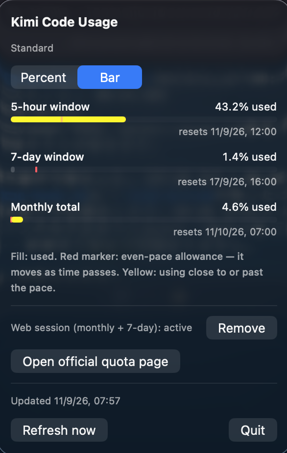

# Kimi Usage Tracker

A lightweight macOS menu bar app that shows your [Kimi Code](https://www.kimi.com/code/) quota at a glance — the Kimi counterpart to menu bar trackers like Claude Usage Tracker.

The menu bar shows how much of your 5-hour window you have used — matching the percentage on the official quota page — in one of two styles: percent capsule or battery-style bar, switchable from the app's panel. Click it for per-window details: per-window gauge bars with a pace pointer, used / limit, reset times, plus a shortcut that opens the official quota page.



With a one-time setup (below), the app also tracks the official page's **7-day window** and **monthly total**, at the same precision as the site.

## Menu bar styles

Pick the style from the segmented control at the top of the panel; the choice is remembered across launches.

- **Percent** (default): a capsule with the used percentage, e.g. `61.3%`.
- **Bar**: a battery-style capsule that fills up as the window is used, with a red **pace pointer** marking how much of the window has already elapsed. The pointer drifts to the right as time passes; if your usage reaches it (fill turns yellow), you are consuming faster than an even pace and will hit the limit before reset.

The percentage and the gauge fill both follow the official page and show **usage** (how much is consumed), not remaining. If the shown window is not the 5-hour one, a small `M` (monthly) or `7d` marker appears next to it, in every style. When the app can't refresh, the last good value stays on screen dimmed.

## Monthly total & 7-day window (optional)

The official subscription page shows two figures the CLI API never exposes: the **monthly total usage** and the **7-day window**. Both come from the same web endpoint the page itself calls (`GetSubscriptionStats` on `www.kimi.ai`), which authenticates with the browser session's tokens — the CLI's access token is rejected there, and `coding/v1/usages` only carries the 5-hour window.

To enable them, paste your web session's refresh token once, from the panel:

1. Open the [quota page](https://www.kimi.ai/settings/subscription?tab=quota) and sign in.
2. DevTools → Application → Local Storage → `https://www.kimi.ai` → copy the value of `refresh_token`.
3. Paste it into the app's panel ("Save").

From then on the app mints its own short-lived access tokens and refreshes the token rotation automatically. Notes:

- The token is stored in `~/Library/Application Support/usage-tracker-kimi/web-refresh-token` with `0600` permissions and is never logged or sent anywhere except Kimi's own auth endpoint.
- The server does not invalidate rotated refresh tokens, so the browser session keeps working in parallel.
- If the web session is removed or expires, the app falls back to the CLI's 5-hour window.

## How it works

- Reads the access token from the Kimi Code CLI's own sign-in state (`$KIMI_CODE_HOME/credentials` or `~/.kimi-code/credentials`).
- Calls `GET https://api.kimi.ai/coding/v1/usages` every 60 seconds and renders whatever windows (`limits[]`) the response contains.
- When the web session is configured, calls `GetSubscriptionStats` instead, which additionally reports the 7-day window and the monthly total at the site's precision; on any web failure the app falls back to the CLI endpoint.
- Only the **access token** and its expiry are read from the CLI credentials. The CLI's refresh token is never touched, the credentials file is never written, and the token is never stored or logged by this app. CLI credentials are re-read on every cycle because the CLI rotates short-lived tokens.
- When the token lapses (the CLI renews it the next time you use it), the last good values stay on screen **dimmed** until a fresh read succeeds. On any failure — expired sign-in, network error, unrecognized response format — the app degrades to stale data instead of inventing numbers.
- The bar gauge is pre-rendered into an `NSImage` with `ImageRenderer` because `MenuBarExtra` labels ignore fixed frames on arbitrary SwiftUI content (text sizes naturally, shapes collapse). Base colors resolve against the current menu bar appearance, with the pace pointer drawn in red on top.

## Privacy boundary

- Reads local sign-in state only to request quota.
- Sends the CLI access token only to Kimi's quota endpoint.
- The web-session refresh token is stored locally (`0600`) and sent only to Kimi's auth endpoint; the rotated replacement is persisted in its place.
- Persists only the last good quota snapshot (numbers and timestamps) under `~/Library/Application Support/usage-tracker-kimi/` so stale display survives restarts.
- No telemetry, analytics, crash reporting, or third-party tracking.

## Requirements

- macOS 13 or later
- A signed-in [Kimi Code](https://www.kimi.com/code/) CLI on the same Mac
- Swift toolchain (Xcode or Command Line Tools) to build

## Build & run

```sh
scripts/make_app.sh
open build/KimiUsageTracker.app
```

`make_app.sh` compiles a release binary, bundles it as `KimiUsageTracker.app` (with `LSUIElement` so it stays out of the Dock), and ad-hoc signs it. To stop the app, use the Quit button in its panel, or `pkill -f KimiUsageTracker`.

## Roadmap

- Signed and notarized releases via GitHub Actions
- Launch at login
- Round gauge menu bar style (percent and bar styles are done)

## Similar tools

- [cc-quota](https://github.com/Robin0725/cc-quota) (MIT) — terminal quota checker for Kimi Code and other coding CLIs.
- [onWatch](https://github.com/onllm-dev/onWatch) — open-source usage tracker for multiple coding agents.
- [Session Watcher](https://sessionwatcher.com/kimi) — commercial macOS menu bar tracker for Kimi Code (5-hour and weekly quotas).

## Acknowledgments

The quota protocol (endpoint, credentials location, expired-token behavior) was informed by [CC Quota](https://github.com/Robin0725/cc-quota) (MIT).

## License

MIT. Not affiliated with or endorsed by Moonshot AI. Kimi is a trademark of its respective owner.
